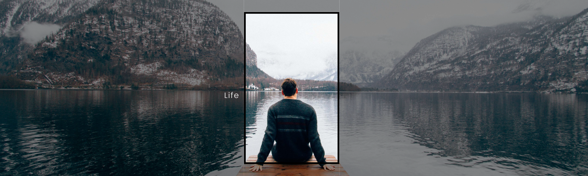

  

##

<h1 align = "center" >Hello! there fellow techies, 
    

  

    I am Ousama 
</h1>

###
### I am passionate about multiple things: 

- Data Science 💻 📊📈
- Geo - informatics 🌌🔭🌍
- Game Design 🎮🕹️👾
- CGI 🗿
- Cinematography 🎬📽️🎞️
- VR/AR with haptics 🥽🤯

### You can always count me in, if you are working on one of these 😉

<!-- 

  

 -->

###

<!-- 

  
  
  

 -->

##

<h3 align="left">👩‍💻  About Me</h3>

###

I'm from planet Earth  
- 🔭 I’m currently a masters student in University of Münster 
- 📚 I'm learning Geo-informatics 
<!-- - ⚡ I have --> 

###

<h3 align="left">🛠 Language and tools</h3>

###

  
  
  
  
  
  
  
  
  
  
  
  
  
  
  
  
  
  
  
  
  
  
  
  
  
  
  
  
  
  
  
  
  
  

  

<!--
###

<h3 align="left">🔥   My Stats :</h3>

###

  

###
-->
